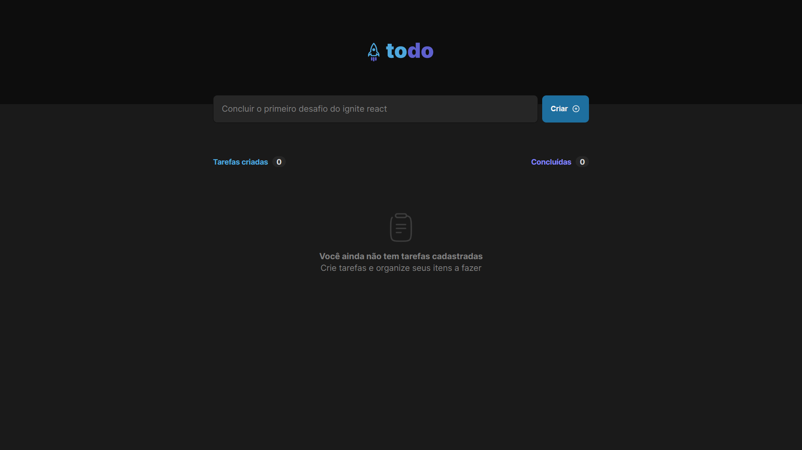

<h1 align="center"> To Do List Ignite</h1>

  Voce pode encontrar demo do projeto no github pages nesse <a href="https://lupebreak.github.io/To-Do-List-Ignite-challenge/">Link</a>

  <a href="#-tecnologias">Tecnologias</a>&nbsp;&nbsp;&nbsp;|&nbsp;&nbsp;&nbsp;
  <a href="#-projeto">Projeto</a>&nbsp;&nbsp;&nbsp;|&nbsp;&nbsp;&nbsp;
  <a href="#memo-licença">Licença</a>

  

 

  

## 🚀 Tecnologias

Esse projeto foi desenvolvido com as seguintes tecnologias:

- Javascript
- Vite
- ReactJS
- Git e Github

## 💻 Projeto

O To do Ignite é uma to do list feita usando vite com react e typescript como desafio para o ignite React a partir de um design proposto no figma.

## :memo: Licença

Esse projeto está sob a licença MIT.

---

Feito com ♥ by [LuPeBreak](https://github.com/LuPeBreak/) como um desafio do Ignite ReactJS da [RocketSeat](https://www.rocketseat.com.br/) utilizando o [design do figma](https://www.figma.com/file/0n0zDN7zbzhRbaEO74Xesx/ToDo-List) como objetivo.
